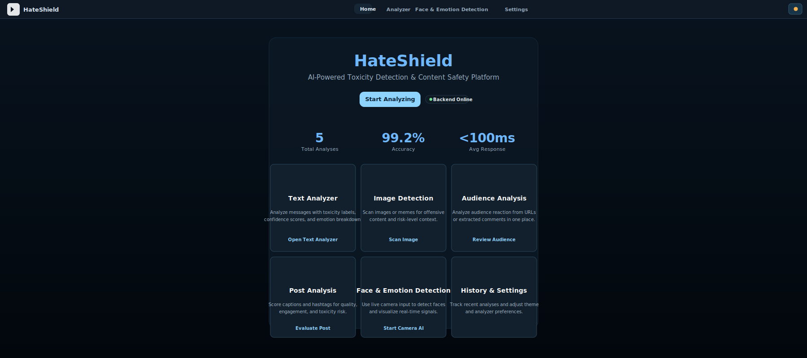

# HateShield AI

HateShield AI is a full-stack content safety and audience-insight platform for analyzing text, images, audience reactions, and pre-publication post quality.

Created and maintained by syedashraf49.

## Project Preview



## What It Does

HateShield combines four core workflows into one lightweight application:

- Text toxicity detection with confidence and emotion breakdowns.
- Image moderation for offensive or harmful visual content.
- Audience sentiment analysis from public URLs or local HTML fixtures.
- Post review scoring for quality, engagement, and publication risk.

## Key Features

### Text Analyzer
- Classifies text as hate speech, offensive, toxic, or safe.
- Returns confidence scores, emotion signals, and processing time.

### Image Detection
- Upload an image for moderation analysis.
- Uses the backend image prediction pipeline for risk classification.

### Audience Analysis
- Accepts a `post_url` / `url` or manual comments.
- Supports local `file://` testing for reliable offline verification.
- Extracts, cleans, and deduplicates comments from HTML.

### Post Analysis
- Evaluates caption, hashtags, description, and target audience.
- Produces quality, engagement, and toxicity risk scoring.
- Returns actionable improvement suggestions and a publish recommendation.

## Tech Stack

Backend:
- Python 3.8+
- Flask
- Flask-CORS
- scikit-learn
- joblib
- Pillow
- transformers
- torch

Frontend:
- HTML
- CSS
- JavaScript
- Static pages served locally with `python -m http.server`

## Repository Layout

```
HateShield/
├─ backend/
│  ├─ app.py
│  ├─ requirements.txt
│  ├─ requirements-train.txt
│  └─ ml/
│     ├─ predictor.py
│     ├─ image_predictor.py
│     ├─ train_model.py
│     ├─ train_dataset.csv
│     ├─ hate_speech_model.pkl
│     └─ vectorizer.pkl
├─ frontend/
│  ├─ index.html
│  ├─ dashboard.html
│  ├─ text-analyzer.html
│  ├─ image-detection.html
│  ├─ audience-analysis.html
│  ├─ post-analysis.html
│  ├─ faceAI.html
│  ├─ settings.html
│  ├─ assets/
│  ├─ css/
│  ├─ js/
│  └─ models/
├─ test_positive.html
├─ test_negative.html
├─ test_neutral.html
├─ TESTING_GUIDE.md
└─ setup_and_run.bat
```

## Quick Start

### One-Step Launch on Windows

Run the startup script from the project root:

```bat
setup_and_run.bat
```

This script verifies Python, installs dependencies, trains the model if required, starts the backend at `http://127.0.0.1:5000`, and serves the frontend at `http://localhost:8000`.

### Manual Launch

Start the backend:

```powershell
cd backend
py -m pip install -r requirements.txt
py app.py
```

Start the frontend in a second terminal:

```powershell
cd frontend
py -m http.server 8000
```

Open `http://localhost:8000` in your browser.

## API Overview

Base URL: `http://127.0.0.1:5000`

### `GET /`
Health check endpoint.

### `POST /analyze`
Analyze a text string for toxicity and emotional tone.

Request:

```json
{ "text": "sample text" }
```

### `POST /analyze_image`
Analyze an uploaded image.

Request: `multipart/form-data` with an `image` field.

### `POST /analyze_audience`
Analyze audience reactions from a URL or manual comments.

Examples:

```json
{ "post_url": "https://example.com/post" }
```

```json
{ "comments": ["comment one", "comment two"] }
```

```json
{ "text": "line 1\nline 2\nline 3" }
```

### `POST /analyze_post`
Run a pre-publication post review.

Request:

```json
{
  "caption": "Your caption",
  "hashtags": "#example #ai #safety",
  "description": "Longer post details",
  "target_audience": "Developers"
}
```

## Testing

The repository includes local HTML fixtures for repeatable audience-analysis testing:

- `test_positive.html`
- `test_negative.html`
- `test_neutral.html`

For exact usage steps and expected sentiment outcomes, see `TESTING_GUIDE.md`.

## Notes

- Some social platforms block automated access or require authentication.
- Pages that load comments only through JavaScript may not be fully extractable.
- Public HTML structure has a direct impact on extraction quality.

## Troubleshooting

- If dependency installation fails, upgrade pip first with `py -m pip install --upgrade pip`.
- If the backend does not start, confirm port `5000` is available.
- If the frontend cannot reach the API, verify that the backend is running and CORS is enabled.

## License

No license file is currently included in this repository. Add one before public or commercial distribution.